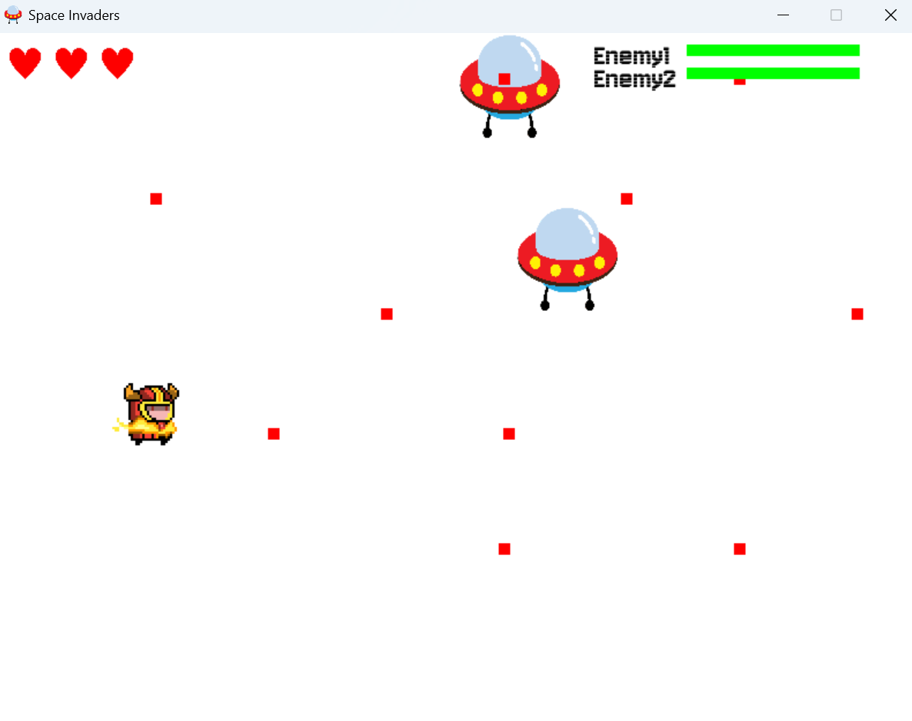

# 11328246

## 專案名稱: Space Invaders射擊小遊戲

**簡介**

**[Part1 遊戲簡介](#part-1-遊戲簡介)**  
**[Part2 遊玩方式](#part-2-遊玩方式)**  
**[Part3 改進與心得](#part-3-改進與心得)**  

---

## **Part 1 遊戲簡介**
本專案由pygame製作，詳細系統資訊可至 [requirements.txt](requirements.txt) 查看。  
本專案是想設計一個簡易的射擊小遊戲，只要點擊滑鼠就能射出子彈攻擊不斷移動的ufo，同時角色本身也可以WASD移動來躲避敵人射來的砲彈，一旦角色的3顆心都用光則遊戲結束，反之成功打敗兩個ufo則獲勝。

### 安裝與執行
1. 確保已安裝Python 3.11.5和Pygame。
2. 下載並解壓縮遊戲檔案。
3. 在命令行中進入遊戲目錄，執行 `main_game.py` 開始遊戲。

### 聲音與音樂
- 遊戲背景音樂：`Time_for_adventure.mp3`
- 音效：無

---
## **Part 2 遊玩方式**

- 這是主要操控的角色，使用 `W`、`A`、`S`、`D` 鍵來移動，使用滑鼠左鍵來射擊子彈
  

- 這是敵方ufo，如果被它的子彈打到會扣一顆心

- 實際遊玩畫面

---

## **Part 3 改進與心得**
可以將ufo的移動做的更加流暢，且增加關卡機制，讓遊戲難度越來越難。
